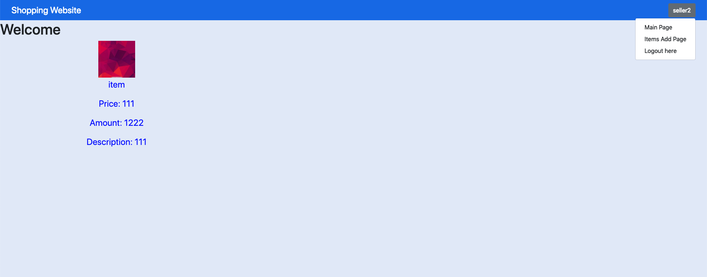

# Shopping Website
## Introduction
* Using Node.js for a website that can publish some items and let user to pay for them
* Using Node ACL for access control list.
* Two roles : User for customer and Seller for seller
## Demo
 .
